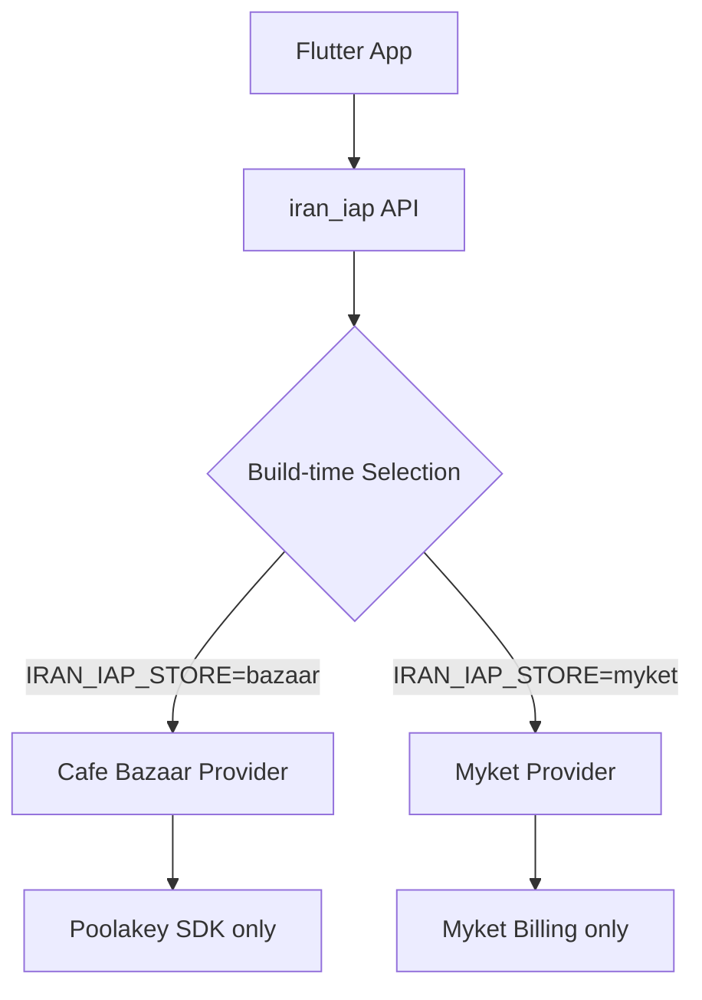

# iran_iap

[](https://github.com/ariaramin/iran-iap/actions/workflows/ci.yml)
[](https://opensource.org/licenses/MIT)
[](https://pub.dev/packages/iran_iap)

Flutter plugin for **Cafe Bazaar** and **Myket** in-app purchases with build-time store selection. One Dart API, one stable dependency, and zero-overhead native SDK isolation.

## Why iran_iap?

Most multi-store IAP wrappers bundle every supported native SDK into your final APK/AAB. For Iranian stores, this can lead to:
1. **Compliance issues**: Publishing a "Bazaar build" that contains Myket code (or vice-versa) may violate store policies.
2. **Binary bloat**: Unused SDKs increase your app size.
3. **Fragile runtime logic**: Complex `if/else` blocks to handle initialization differences.

`iran_iap` solves this with **compile-time isolation**:



**One artifact. One store billing SDK.**

---

## Core guarantees

- **Build Isolation**: A Bazaar build contains zero Myket code, and vice-versa.
- **Stable API**: Unified Dart interface for products, purchases, and subscriptions.
- **Typed Outcomes**: User cancellation is a result, not an exception.
- **Security First**: Designed for backend verification; safe defaults.

## Supported stores

- **Cafe Bazaar** (Android)
- **Myket** (Android)

## Requirements

- Flutter `>=3.44.0`
- Dart `>=3.12.0 <4.0.0`
- Android `minSdk 24`
- Java 17+

---

## Installation

Add to `pubspec.yaml`:

```yaml
dependencies:
  iran_iap: ^0.3.0
```

### 1. Android Repository Setup

Add JitPack to `android/build.gradle.kts`:

```kotlin
allprojects {
    repositories {
        google()
        mavenCentral()
        maven {
            url = uri("https://jitpack.io")
            content {
                includeGroup("com.github.cafebazaar.Poolakey")
                includeGroup("com.github.myketstore")
            }
        }
    }
}
```

### 2. Myket Manifest Placeholders

Add to `android/app/build.gradle.kts`:

```kotlin
android {
    defaultConfig {
        manifestPlaceholders["marketApplicationId"] = "ir.mservices.market"
        manifestPlaceholders["marketBindAddress"] = "ir.mservices.market.InAppBillingService.BIND"
        manifestPlaceholders["marketPermission"] = "ir.mservices.market.BILLING"
    }
}
```

### 3. Host Activity

Use `FlutterFragmentActivity` in `MainActivity.kt`:

```kotlin
import io.flutter.embedding.android.FlutterFragmentActivity

class MainActivity: FlutterFragmentActivity()
```

---

## Quick Start

### Initialize

```dart
final iap = IranIap(
  config: const IranIapConfig(
    storePublicKey: '...', // Required for Myket
  ),
);

await iap.initialize();
```

### Purchase Flow

```dart
final outcome = await iap.purchase(
  const IapPurchaseRequest(
    productId: 'premium_upgrade',
    type: IapProductType.inApp,
  ),
);

if (outcome is PurchaseCompleted) {
  // Send outcome.purchase.token to your backend for verification
}
```

### Build Commands

Bazaar:
```bash
dart run iran_iap build apk --store bazaar --release
```

Myket:
```bash
dart run iran_iap build apk --store myket --release
```

---

## More Information

- [Architecture](docs/ARCHITECTURE.md) — How build isolation works.
- [Security](SECURITY.md) — Safeguarding purchases.
- [CLI Reference](bin/iran_iap.dart) — Helper commands.
- [Contributing](CONTRIBUTING.md) — Development setup.
- [Release Checklist](docs/RELEASE_CHECKLIST.md) — Steps for production readiness.
- [Example App](example/) — Full implementation demo.

## License

MIT License. See [LICENSE](LICENSE).
Native SDKs are separate dependencies. See [THIRD_PARTY_NOTICES.md](THIRD_PARTY_NOTICES.md).
