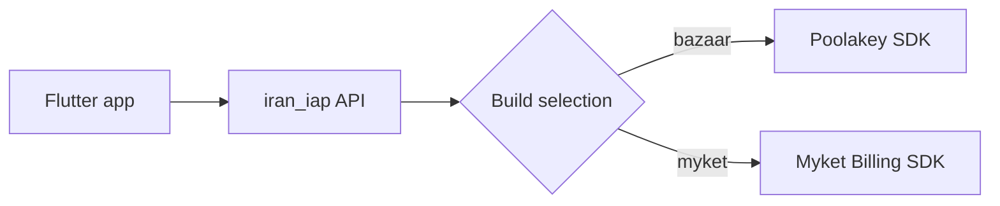

# iran_iap

[](https://github.com/ariaramin/iran-iap/actions/workflows/ci.yml)
[](https://pub.dev/packages/iran_iap)
[](LICENSE)

Build-time isolated in-app purchases for **Cafe Bazaar** and **Myket**. Use one
Dart API while shipping only the native billing SDK selected for each Android
artifact.

## Why iran_iap?

Multi-store wrappers commonly place every provider SDK in every APK or AAB.
`iran_iap` selects the provider at build time instead:



The unselected billing SDK and its adapter are not compiled into the artifact.
The repository includes an artifact scanner to enforce this boundary.

## Features

- One store-agnostic API for products, purchases, subscriptions, and consumption.
- Build-time Cafe Bazaar/Myket source-set and dependency isolation.
- Typed purchase cancellation through `PurchaseCancelled`.
- Stable `IapErrorCode` values with optional native diagnostics.
- Idempotent initialization and disposal.
- Runtime capability reporting.
- CLI commands for host checks, store-aware runs/builds, and artifact verification.

## Platform support

| Platform | Cafe Bazaar | Myket |
| --- | --- | --- |
| Android | Supported | Supported |
| iOS, macOS, Linux, Windows, web | Not supported | Not supported |

Requirements:

- Flutter `>=3.44.0`
- Dart `>=3.12.0 <4.0.0`
- Android `minSdk 24`
- Java 17 or newer

## Installation

Add the package:

```yaml
dependencies:
  iran_iap: ^0.3.0
```

Then run:

```bash
flutter pub get
```

## Android setup

### 1. Add JitPack

Both native billing SDKs are resolved from JitPack. Add the repository once in
the host project's `android/build.gradle.kts`:

```kotlin
allprojects {
    repositories {
        google()
        mavenCentral()
        maven {
            url = uri("https://jitpack.io")
            content {
                includeGroup("com.github.cafebazaar.Poolakey")
                includeGroup("com.github.myketstore")
            }
        }
    }
}
```

Use the equivalent `maven { url 'https://jitpack.io' }` syntax in Groovy
projects.

### 2. Add Myket manifest placeholders

Myket builds require these values in
`android/app/build.gradle.kts`:

```kotlin
android {
    defaultConfig {
        manifestPlaceholders["marketApplicationId"] = "ir.mservices.market"
        manifestPlaceholders["marketBindAddress"] =
            "ir.mservices.market.InAppBillingService.BIND"
        manifestPlaceholders["marketPermission"] =
            "ir.mservices.market.BILLING"
    }
}
```

It is safe to keep the placeholders in every build; they are inert when the
Myket SDK is not selected.

### 3. Use a compatible host activity

Cafe Bazaar purchase flows use Android's Activity Result API. Make the host
activity extend `FlutterFragmentActivity`:

```kotlin
package com.example.app

import io.flutter.embedding.android.FlutterFragmentActivity

class MainActivity : FlutterFragmentActivity()
```

Check the host configuration at any time:

```bash
dart run iran_iap doctor --store bazaar
dart run iran_iap doctor --store myket
```

## Select a store at build time

The bundled CLI supplies both the Dart define and matching Gradle property:

```bash
dart run iran_iap run --store bazaar
dart run iran_iap build apk --store bazaar -- --release
dart run iran_iap build appbundle --store myket -- --release
```

Place Flutter-specific options after `--`; options before it belong to the
`iran_iap` CLI.

The CLI returns `0` on success, `64` for invalid invocation syntax, and `66`
when a required project or artifact cannot be found. Exit status `70` indicates
that the installed verifier asset is unavailable. Build/run commands forward
Flutter's exit status; doctor and verification failures return a non-zero status
suitable for CI.

Standard Flutter commands also work:

```bash
flutter run --dart-define=IRAN_IAP_STORE=bazaar
flutter build appbundle --release --dart-define=IRAN_IAP_STORE=myket
```

Store selection is compile-time state. Stop and rebuild the app when switching
stores; a hot restart cannot change it.

## Initialize the client

Cafe Bazaar defaults to backend verification and does not require a public key:

```dart
final iap = IranIap();
await iap.initialize();
```

Myket requires the store-provided RSA public key:

```dart
final iap = IranIap(
  config: const IranIapConfig(storePublicKey: 'YOUR_PUBLIC_KEY'),
);
await iap.initialize();
```

The public key is verification material, not a private server secret. Never put
private keys, API secrets, or backend credentials in a Flutter application.

For optional Cafe Bazaar client-side signature checking:

```dart
final iap = IranIap(
  config: const IranIapConfig(
    storePublicKey: 'YOUR_BAZAAR_PUBLIC_KEY',
    bazaarSecurityMode: BazaarSecurityMode.localVerification,
  ),
);
```

Backend verification remains the authorization boundary for valuable
entitlements.

## Query products

```dart
final products = await iap.queryProducts(
  {'coin_pack', 'premium_monthly'},
  type: IapProductType.inApp,
);

for (final product in products) {
  print('${product.title}: ${product.price}');
}
```

`IapProduct.price` is localized display text. Do not parse it for accounting or
entitlement decisions.

## Start a purchase

```dart
final outcome = await iap.purchase(
  const IapPurchaseRequest(
    productId: 'coin_pack',
    type: IapProductType.inApp,
    payload: 'order-correlation-id',
  ),
);

switch (outcome) {
  case PurchaseCompleted():
    // Send purchase evidence to a trusted backend before granting access.
    break;
  case PurchaseCancelled():
    // Cancellation is expected user behavior, not an exception.
    break;
}
```

Cafe Bazaar dynamic pricing is available through
`IapPurchaseRequest.dynamicPriceToken`. Myket rejects that option with
`IapErrorCode.featureUnavailable`.

## Restore and consume purchases

Query currently owned products or subscriptions:

```dart
final purchases = await iap.queryPurchases(
  type: IapProductType.inApp,
);
```

After the backend has verified and durably recorded a consumable purchase:

```dart
await iap.consume(purchase);
```

Subscriptions cannot be consumed. A purchase returned by one store cannot be
consumed by a client built for the other store.

## Configuration and capabilities

| Option | Default | Behavior |
| --- | --- | --- |
| `storePublicKey` | `null` | Required by Myket and Bazaar local verification. |
| `bazaarSecurityMode` | `serverVerification` | Enables or disables Poolakey's local RSA check. |
| `enableSubscriptions` | `true` | Requests subscription support for Cafe Bazaar. |

After initialization, inspect `iap.capabilities` before exposing optional UI:

```dart
if (iap.capabilities.supportsSubscriptions) {
  // Show subscription products.
}
```

## Error handling

Operational failures throw `IapException`. Branch on its stable `code`, not on
provider-specific messages:

```dart
try {
  await iap.initialize();
} on IapException catch (error) {
  switch (error.code) {
    case IapErrorCode.storeNotInstalled:
      // Prompt the user to install the selected store.
      break;
    case IapErrorCode.serviceUnavailable:
      // Offer a retry.
      break;
    default:
      // Record a redacted diagnostic and show a safe fallback.
      break;
  }
}
```

`nativeCode`, `nativeMessage`, `nativeExceptionType`, and `details` are
diagnostic fields. Do not use them as the business-logic contract, and do not
log purchase tokens, receipts, signatures, or user secrets.

Only one asynchronous billing operation may run at a time. Overlapping calls
fail with `IapErrorCode.operationInProgress`.

## Lifecycle

Create one client for the lifetime of the owning service or feature. Repeated
`initialize()` calls share the same connection. Dispose it when finished:

```dart
await iap.dispose();
```

A disposed client cannot be reused; create a new `IranIap` instance instead.

## Verify artifact isolation

After building an APK or AAB, scan it for the unselected billing SDK:

```bash
dart run iran_iap verify --store bazaar build/app/outputs/flutter-apk/app-release.apk
dart run iran_iap verify --store myket build/app/outputs/bundle/release/app-release.aab
```

The verifier requires Python 3. It is a conservative release guard, not a
formal proof; keep the store's real-device billing tests in the release process.

## Troubleshooting

### No store is selected

Build with `--store bazaar|myket` through the CLI or pass a matching
`IRAN_IAP_STORE` Dart define. Rebuild instead of hot restarting.

### Native SDK dependency cannot be resolved

Confirm JitPack is present in the host Android repositories and is not blocked
by a restrictive repository policy.

### Bazaar reports `activityUnavailable`

Use `FlutterFragmentActivity` (or another `ActivityResultRegistryOwner`) for the
host activity.

### Myket initialization reports a configuration error

Provide a non-empty `storePublicKey` and all three manifest placeholders shown
above, then run `dart run iran_iap doctor --store myket`.

### The billing connection is lost

`IapErrorCode.notInitialized` resets the client's ready state. Call
`initialize()` again before retrying the operation.

## Example

The [`example/`](example/) app demonstrates initialization, product lookup,
purchase, owned-purchase queries, cancellation, errors, and consumption. Run it
with a configured test product and store account:

```bash
dart run iran_iap run --project-dir example --store bazaar
```

Real billing tests require a physical Android device with the selected store
installed and signed in.

## Contributing

See [CONTRIBUTING.md](CONTRIBUTING.md) for setup and validation commands.
Architecture and release details are in the
[architecture guide](https://github.com/ariaramin/iran-iap/blob/main/docs/ARCHITECTURE.md)
and
[release checklist](https://github.com/ariaramin/iran-iap/blob/main/docs/RELEASE_CHECKLIST.md).

Security issues should be reported through GitHub's private security advisory
flow as described in [SECURITY.md](SECURITY.md).

## License

`iran_iap` is available under the [MIT License](LICENSE). Native billing SDKs
remain subject to their upstream terms; see
[THIRD_PARTY_NOTICES.md](THIRD_PARTY_NOTICES.md).
