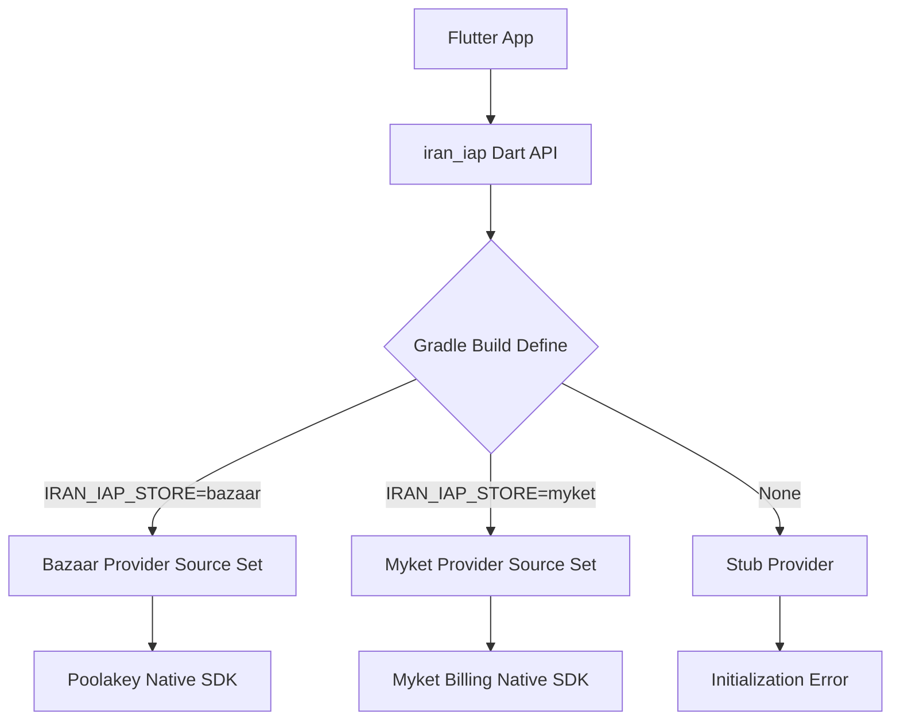

# Architecture

## Goal

`iran_iap` keeps one Flutter dependency in the application while guaranteeing that store-specific native billing code is selected at Android build time rather than at Dart runtime.

## Build isolation

### Invariant
**A Bazaar artifact must not contain Myket native billing code or dependencies, and vice versa.**

## Implementation details

- **Dart API layer**: Stable interface in `lib/`. Hides all store-specific types.
- **MethodChannel layer**: Standard Flutter platform channel communication.
- **Android plugin entrypoint**: `IranIapPlugin.kt` in `android/src/main`. Dispatches to the selected `SelectedStorePlugin` implementation.
- **Store-specific native adapters**: Located in `android/src/bazaar` and `android/src/myket`.
- **Gradle source-set selection**: The `build.gradle` in the plugin uses `iranIapStore` property to add the correct `src` directory and implementation dependency.
- **Stub behavior**: If no store is selected, a stub provider is injected which throws a clear "No store selected" error during `initialize()`.
- **Lifecycle**: Plugin follows the Flutter Activity/Fragment lifecycle to ensure billing connections are established and released correctly.

## Verification

The repository includes a Python-based artifact scanner (`tool/verify_android_artifact.py`) that checks the final APK/AAB for forbidden byte patterns (e.g., searching for `ir.mservices.market` in a Bazaar build).
